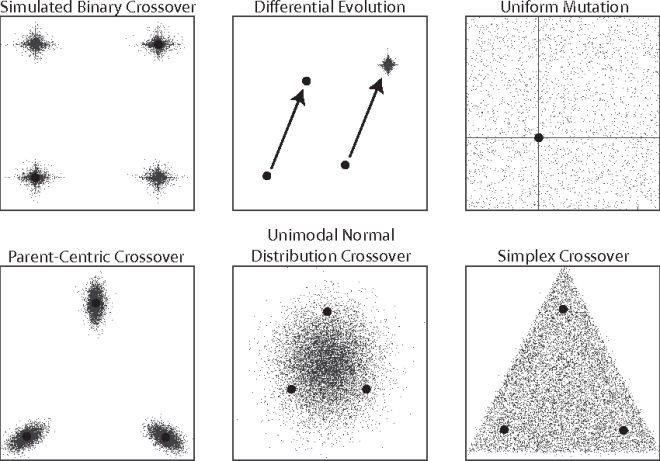
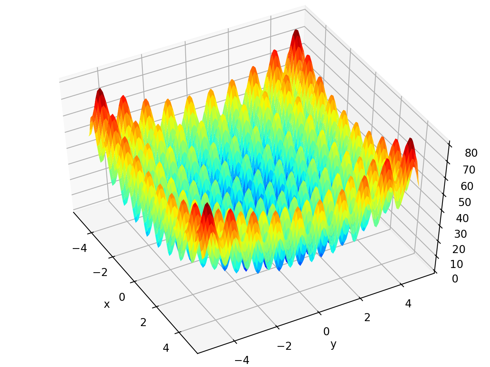
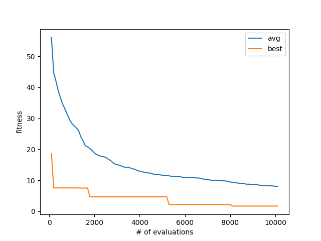

# 木下 貴登 2210104022
## 概要
実数値GAの交叉方法のひとつであるSimplex Crossover (SPX) がDEAPで実装されていなかったので，
`SPX.py`に`cxSimplexCrossover`と`cxSimplexCrossoverBounded`として実装した (関数の命名規則は雰囲気でDEAPに合わせた)．

SPXの挙動はこんな感じ :

[引用元](https://waterprogramming.wordpress.com/2018/11/26/introduction-to-borg-operators-part-1-simplex-crossover-spx/)

## 実験
### 実験設定
`example.py`に実験のコードを実装した．
~~低反発マットみたいでかわいかったので~~
大域最適解が変数の値域の真ん中にありSPXに向いてる気がしたので3変数のrastrigin関数をベンチマーク関数として選んだ．

### 実験結果
大域最適解は得られなかったが，まあまあ最適化できた．

## 考察
比較手法を用意していないので性能がいいのかよくわからないし，そもそもSPXは多峰性関数よりも変数依存が強い問題に向いてる気がする．

あと，交叉の結果をプロットしてるわけでもないのでちゃんと動いてるのかも不明．

## 参考文献
Takahide Higuchi, Shigeyoshi Tsutsui, Masayuki Yamamura,
Simplex Crossover for Real-coded Genetic Algolithms,
Transactions of the Japanese Society for Artificial Intelligence,
2001, Volume 16, Issue 1, Pages 147-155, Released February 28, 2002.
